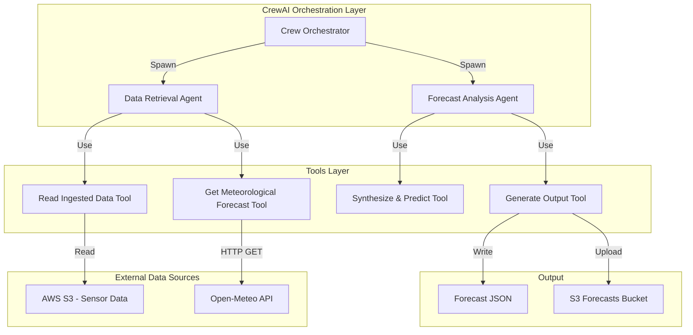
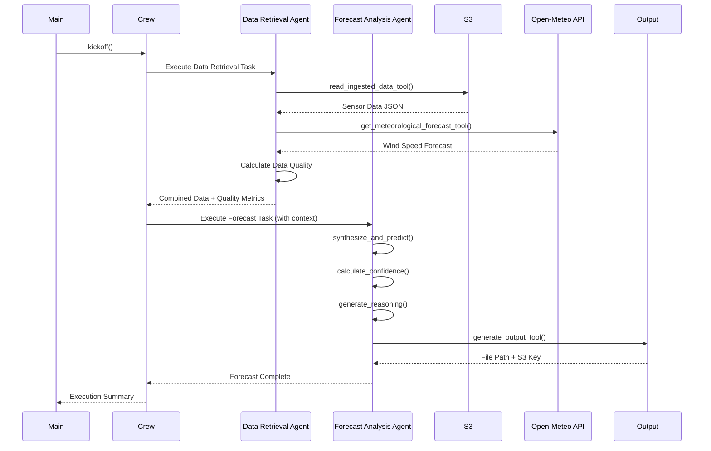

# ForecastAgent - Technical Specification

## Architecture Overview

ForecastAgent is an autonomous AI system built on CrewAI that predicts 24-hour air quality forecasts for Delhi by synthesizing historical sensor data from AWS S3, real-time meteorological forecasts from Open-Meteo API, and applying intelligent reasoning logic to generate actionable AQI predictions with confidence levels.

### System Architecture Diagram



## Technology Stack

### Core Framework
- **CrewAI** (v0.1.0+): Multi-agent orchestration framework
  - Agent abstraction with role-based specialization
  - Task coordination and context passing
  - Built-in logging and error handling
  - LLM integration for reasoning

### Programming Language
- **Python 3.11+**: Primary development language
  - Type hints for code quality
  - Dataclasses for data models
  - Rich ecosystem for data processing

### Key Libraries

#### Data Processing
- **Pydantic** (v2.0+): Data validation and schema definition
- **pandas**: Time series analysis and data manipulation
- **requests** (v2.31+): HTTP client for API calls

#### AWS Integration
- **boto3** (v1.28+): AWS SDK for Python
  - S3 client for reading sensor data
  - IAM role integration
  - CloudWatch logging

#### Configuration & Environment
- **python-dotenv** (v1.0+): Environment variable management

#### Testing
- **pytest**: Unit and integration testing
- **pytest-mock**: Mocking external dependencies
- **responses**: HTTP request mocking
- **moto**: AWS service mocking

#### Development Tools
- **black**: Code formatting
- **ruff**: Fast Python linter
- **mypy**: Static type checking

## Component Architecture

### 1. Agent Layer

#### Data Retrieval Agent
```python
Role: "Data Collector and Validator"
Goal: "Retrieve all necessary input data from S3 and meteorological APIs with validation"
Tools: [read_ingested_data_tool, get_meteorological_forecast_tool]
```

**Responsibilities**:
- Read latest sensor data JSON from S3
- Parse and validate data structure
- Fetch wind speed forecasts from Open-Meteo
- Calculate data quality metrics (completeness, recency)
- Report data availability to Forecast Analysis Agent

**Key Methods**:
```python
def retrieve_sensor_data(bucket_name: str, object_key: str | None = None) -> dict:
    """Retrieve and validate sensor data from S3"""
    
def fetch_meteorological_data(latitude: float, longitude: float, hours: int = 48) -> dict:
    """Fetch wind speed forecast from Open-Meteo API"""
    
def calculate_data_quality(sensor_data: dict, meteo_data: dict) -> dict:
    """Calculate completeness and recency metrics"""
```

#### Forecast Analysis Agent
```python
Role: "Air Quality Forecaster and Reasoner"
Goal: "Generate accurate 24-hour AQI predictions with confidence levels and clear reasoning"
Tools: [synthesize_and_predict_tool, generate_output_tool]
```

**Responsibilities**:
- Synthesize sensor data and meteorological forecasts
- Apply threshold-based prediction logic
- Calculate confidence levels based on data quality
- Generate natural language reasoning statements
- Format and output structured JSON predictions

**Key Methods**:
```python
def synthesize_prediction(sensor_data: dict, meteo_data: dict) -> dict:
    """Apply reasoning logic to generate AQI prediction"""
    
def calculate_confidence(data_quality: dict, prediction: dict) -> float:
    """Calculate confidence level (0-100) based on data quality"""
    
def generate_reasoning(prediction: dict, inputs: dict) -> str:
    """Generate IF-AND-THEN reasoning statement"""
    
def format_output(prediction: dict, confidence: float, reasoning: str) -> dict:
    """Format final JSON output structure"""
```

### 2. Tools Layer

#### read_ingested_data_tool

**Purpose**: Read sensor data JSON files from AWS S3 (produced by SensorIngestAgent)

**Implementation**:
```python
from crewai_tools import tool
import boto3
import json
from datetime import datetime

@tool("Read ingested sensor data from S3")
def read_ingested_data_tool(bucket_name: str, object_key: str | None = None) -> dict:
    """
    Read sensor data JSON from S3 bucket.
    
    Args:
        bucket_name: S3 bucket name
        object_key: Specific object key, or None to fetch latest
        
    Returns:
        Dict containing CPCB AQI, NASA fire counts, DSS source percentages
    """
    try:
        s3 = boto3.client('s3')
        
        # If no object_key provided, get latest file
        if object_key is None:
            response = s3.list_objects_v2(
                Bucket=bucket_name,
                Prefix='data/aqi_data_'
            )
            if 'Contents' not in response:
                return {"error": "No sensor data files found in S3"}
            
            # Sort by LastModified and get latest
            objects = sorted(response['Contents'], 
                           key=lambda x: x['LastModified'], 
                           reverse=True)
            object_key = objects[0]['Key']
        
        # Read object
        obj = s3.get_object(Bucket=bucket_name, Key=object_key)
        data = json.loads(obj['Body'].read().decode('utf-8'))
        
        # Parse and structure data
        return parse_sensor_data(data)
        
    except Exception as e:
        return {"error": f"S3 read failed: {str(e)}"}
```

**Output Format**:
```python
{
    "cpcb_data": {
        "aqi": 380.0,
        "timestamp": "2025-11-13T08:00:00Z",
        "station": "Delhi-Anand Vihar",
        "pm25": 250.5,
        "pm10": 420.3
    },
    "nasa_data": {
        "fire_count": 450,
        "region": "Punjab-Haryana",
        "timestamp": "2025-11-13T08:00:00Z",
        "confidence_high": 380
    },
    "dss_data": {
        "stubble_burning_percent": 22.0,
        "vehicular_percent": 35.0,
        "industrial_percent": 18.0,
        "dust_percent": 15.0,
        "timestamp": "2025-11-13T08:00:00Z"
    },
    "data_quality": {
        "completeness": 1.0,  # 0-1 scale
        "age_hours": 2.5
    }
}
```

#### get_meteorological_forecast_tool

**Purpose**: Fetch 48-hour wind speed forecast for Delhi from Open-Meteo API

**Implementation**:
```python
@tool("Get meteorological forecast from Open-Meteo")
def get_meteorological_forecast_tool(
    latitude: float = 28.6139,
    longitude: float = 77.2090,
    hours: int = 48
) -> dict:
    """
    Fetch wind speed forecast for Delhi.
    
    Args:
        latitude: Delhi latitude (default: 28.6139)
        longitude: Delhi longitude (default: 77.2090)
        hours: Forecast hours (default: 48)
        
    Returns:
        Dict containing hourly wind speed forecasts
    """
    import requests
    from datetime import datetime
    
    url = "https://api.open-meteo.com/v1/forecast"
    params = {
        "latitude": latitude,
        "longitude": longitude,
        "hourly": "wind_speed_10m",
        "forecast_days": 2,
        "wind_speed_unit": "kmh"
    }
    
    try:
        response = requests.get(url, params=params, timeout=10)
        response.raise_for_status()
        data = response.json()
        
        # Parse hourly data
        hourly_wind = []
        for i, (time, speed) in enumerate(zip(
            data['hourly']['time'],
            data['hourly']['wind_speed_10m']
        )):
            if i >= hours:
                break
            hourly_wind.append({
                "timestamp": time,
                "wind_speed_kmh": speed
            })
        
        return {
            "hourly_wind_speed": hourly_wind,
            "location": {
                "latitude": latitude,
                "longitude": longitude,
                "city": "Delhi"
            },
            "forecast_retrieved_at": datetime.utcnow().isoformat()
        }
        
    except Exception as e:
        return {"error": f"Open-Meteo API failed: {str(e)}"}
```

#### synthesize_and_predict_tool

**Purpose**: Apply reasoning logic to generate AQI prediction

**Prediction Thresholds**:
```python
# Configurable thresholds
SEVERE_AQI_THRESHOLD = 401
VERY_POOR_AQI_THRESHOLD = 301
HIGH_FIRE_COUNT = 400
LOW_WIND_SPEED_KMH = 10
HIGH_STUBBLE_PERCENT = 20
```

**Reasoning Logic**:
```python
def synthesize_and_predict(sensor_data: dict, meteo_data: dict) -> dict:
    """
    Apply threshold-based reasoning to predict AQI.
    
    Logic:
    - IF fire_count > 400 AND avg_wind_speed < 10 km/h AND stubble_burning >= 20%
      THEN predict AQI will cross Severe threshold (401)
    - Calculate estimated hours to threshold based on current AQI trend
    - Generate IF-AND-THEN reasoning statement
    """
    
    fire_count = sensor_data['nasa_data']['fire_count']
    stubble_percent = sensor_data['dss_data']['stubble_burning_percent']
    current_aqi = sensor_data['cpcb_data']['aqi']
    
    # Calculate average wind speed for next 24 hours
    wind_speeds = [h['wind_speed_kmh'] for h in meteo_data['hourly_wind_speed'][:24]]
    avg_wind_speed = sum(wind_speeds) / len(wind_speeds)
    
    # Apply prediction logic
    if (fire_count > HIGH_FIRE_COUNT and 
        avg_wind_speed < LOW_WIND_SPEED_KMH and 
        stubble_percent >= HIGH_STUBBLE_PERCENT):
        
        # Estimate hours to threshold
        aqi_gap = SEVERE_AQI_THRESHOLD - current_aqi
        estimated_hours = calculate_time_to_threshold(
            aqi_gap, fire_count, avg_wind_speed, stubble_percent
        )
        
        prediction = {
            "aqi_category": "Severe",
            "threshold": SEVERE_AQI_THRESHOLD,
            "estimated_hours_to_threshold": estimated_hours
        }
        
        reasoning = (
            f"IF SensorIngestAgent reports {fire_count} new fires, "
            f"AND meteorological data shows low wind speed ({avg_wind_speed:.1f} km/h average over next 24h), "
            f"AND DSS forecasts stubble burning's contribution will rise to {stubble_percent}%, "
            f"THEN I predict the AQI will cross the 'Severe' threshold ({SEVERE_AQI_THRESHOLD}) "
            f"in {estimated_hours} hours."
        )
        
    else:
        # Other prediction scenarios...
        prediction = generate_alternative_prediction(sensor_data, meteo_data)
        reasoning = generate_alternative_reasoning(sensor_data, meteo_data)
    
    return {
        "prediction": prediction,
        "reasoning": reasoning
    }
```

**Confidence Calculation**:
```python
def calculate_confidence(data_quality: dict, api_errors: list) -> float:
    """
    Calculate confidence level (0-100) based on data quality.
    
    Factors:
    - Data completeness: multiply by completeness ratio
    - Data age: reduce if older than 6 hours
    - API failures: reduce by 20-30% per failure
    """
    confidence = 100.0
    
    # Adjust for completeness
    confidence *= data_quality['completeness']
    
    # Adjust for data age
    age_hours = data_quality['age_hours']
    if age_hours > 6:
        age_penalty = max(0.5, 1.0 - (age_hours - 6) / 24)
        confidence *= age_penalty
    
    # Adjust for API errors
    if api_errors:
        confidence *= (0.8 ** len(api_errors))
    
    return round(max(0.0, min(100.0, confidence)), 1)
```

#### generate_output_tool

**Purpose**: Format and write final prediction JSON

**Output Structure**:
```json
{
    "prediction": {
        "aqi_category": "Severe",
        "threshold": 401,
        "estimated_hours_to_threshold": 18
    },
    "confidence_level": 85.5,
    "reasoning": "IF SensorIngestAgent reports 450 new fires, AND meteorological data shows low wind speed (8 km/h average over next 24h), AND DSS forecasts stubble burning's contribution will rise to 22%, THEN I predict the AQI will cross the 'Severe' threshold (401) in 18 hours.",
    "timestamp": "2025-11-13T10:30:00Z",
    "data_sources": {
        "sensor_data_age_hours": 2.5,
        "meteorological_forecast_retrieved": true,
        "cpcb_available": true,
        "nasa_available": true,
        "dss_available": true
    },
    "metadata": {
        "agent_version": "1.0.0",
        "execution_time_seconds": 12.5
    }
}
```

**Implementation**:
```python
@tool("Generate forecast output JSON")
def generate_output_tool(
    prediction: dict,
    confidence: float,
    reasoning: str,
    data_sources: dict,
    output_dir: str = "forecast-agent/output"
) -> dict:
    """
    Format and write forecast JSON to file and optionally S3.
    
    Args:
        prediction: Prediction dict with aqi_category, threshold, estimated_hours
        confidence: Confidence level (0-100)
        reasoning: Natural language reasoning statement
        data_sources: Data source availability and quality info
        output_dir: Local output directory
        
    Returns:
        Dict with output file path and S3 key (if uploaded)
    """
    import os
    import json
    from datetime import datetime
    
    timestamp = datetime.utcnow()
    
    output = {
        "prediction": prediction,
        "confidence_level": confidence,
        "reasoning": reasoning,
        "timestamp": timestamp.isoformat() + "Z",
        "data_sources": data_sources,
        "metadata": {
            "agent_version": "1.0.0",
            "execution_time_seconds": 0  # Set by caller
        }
    }
    
    # Write to local file
    os.makedirs(output_dir, exist_ok=True)
    filename = f"forecast_{timestamp.strftime('%Y%m%d_%H%M%S')}.json"
    filepath = os.path.join(output_dir, filename)
    
    with open(filepath, 'w') as f:
        json.dump(output, f, indent=2)
    
    result = {"local_file": filepath}
    
    # Optional: Upload to S3
    if os.getenv('FORECAST_UPLOAD_TO_S3', 'false').lower() == 'true':
        s3_key = upload_to_s3(output, filename)
        result["s3_key"] = s3_key
    
    return result
```

### 3. Data Model Layer

**Pydantic Models**:
```python
from pydantic import BaseModel, Field
from datetime import datetime

class CPCBData(BaseModel):
    aqi: float = Field(..., ge=0)
    timestamp: datetime
    station: str
    pm25: float | None = None
    pm10: float | None = None

class NASAFireData(BaseModel):
    fire_count: int = Field(..., ge=0)
    region: str
    timestamp: datetime
    confidence_high: int | None = None

class DSSData(BaseModel):
    stubble_burning_percent: float = Field(..., ge=0, le=100)
    vehicular_percent: float = Field(..., ge=0, le=100)
    industrial_percent: float = Field(..., ge=0, le=100)
    dust_percent: float | None = Field(None, ge=0, le=100)
    timestamp: datetime

class SensorData(BaseModel):
    cpcb_data: CPCBData
    nasa_data: NASAFireData
    dss_data: DSSData
    data_quality: dict[str, float]

class HourlyWindSpeed(BaseModel):
    timestamp: str
    wind_speed_kmh: float

class MeteorologicalForecast(BaseModel):
    hourly_wind_speed: list[HourlyWindSpeed]
    location: dict[str, float | str]
    forecast_retrieved_at: str

class AQIPrediction(BaseModel):
    aqi_category: str
    threshold: int
    estimated_hours_to_threshold: int

class ForecastOutput(BaseModel):
    prediction: AQIPrediction
    confidence_level: float = Field(..., ge=0, le=100)
    reasoning: str
    timestamp: str
    data_sources: dict
    metadata: dict
```

### 4. Configuration Layer

**Environment Configuration**:
```python
from pydantic_settings import BaseSettings

class AWSConfig(BaseSettings):
    """AWS configuration"""
    aws_access_key_id: str | None = None
    aws_secret_access_key: str | None = None
    aws_default_region: str = "ap-south-1"
    s3_bucket_name: str

class LLMConfig(BaseSettings):
    """LLM configuration for CrewAI"""
    gemini_api_key: str

class ForecastConfig(BaseSettings):
    """Forecast-specific configuration"""
    forecast_output_dir: str = "forecast-agent/output"
    forecast_upload_to_s3: bool = False
    delhi_latitude: float = 28.6139
    delhi_longitude: float = 77.2090
    forecast_hours: int = 48

class ThresholdsConfig(BaseSettings):
    """Prediction thresholds"""
    severe_aqi_threshold: int = 401
    very_poor_aqi_threshold: int = 301
    high_fire_count: int = 400
    low_wind_speed_kmh: float = 10.0
    high_stubble_percent: float = 20.0

class AppConfig(BaseSettings):
    """Application configuration"""
    log_level: str = "INFO"
    
    aws: AWSConfig
    llm: LLMConfig
    forecast: ForecastConfig
    thresholds: ThresholdsConfig
    
    class Config:
        env_file = ".env"
        env_nested_delimiter = "__"
```

### 5. Utility Layer

**Logger Configuration**:
```python
import logging

def setup_logging(level: str = "INFO") -> logging.Logger:
    """Configure application logging"""
    logging.basicConfig(
        level=getattr(logging, level),
        format='%(asctime)s - %(name)s - %(levelname)s - %(message)s',
        handlers=[
            logging.StreamHandler(),
            logging.FileHandler('forecast_agent.log')
        ]
    )
    return logging.getLogger('forecast_agent')
```

**Retry Logic**:
```python
import time
from functools import wraps

def retry_with_backoff(max_attempts=3, backoff_factor=2):
    """Decorator for retry logic with exponential backoff"""
    def decorator(func):
        @wraps(func)
        def wrapper(*args, **kwargs):
            for attempt in range(max_attempts):
                try:
                    return func(*args, **kwargs)
                except Exception as e:
                    if attempt == max_attempts - 1:
                        raise
                    wait_time = backoff_factor ** attempt
                    logger.warning(
                        f"Attempt {attempt + 1} failed: {e}. "
                        f"Retrying in {wait_time}s..."
                    )
                    time.sleep(wait_time)
        return wrapper
    return decorator
```

## Data Flow

### Execution Sequence



### Data Transformation Pipeline

1. **Data Retrieval**
   - Read latest sensor data from S3
   - Fetch meteorological forecast from Open-Meteo
   - Validate data structure and completeness
   - Calculate data quality metrics

2. **Data Synthesis**
   - Extract key metrics (fire count, wind speed, stubble burning %)
   - Calculate averages and trends
   - Apply threshold-based logic
   - Estimate time to AQI threshold

3. **Prediction Generation**
   - Generate AQI category prediction
   - Calculate confidence level
   - Create IF-AND-THEN reasoning statement
   - Add metadata and timestamps

4. **Output Formatting**
   - Structure JSON output
   - Write to local file
   - Optional S3 upload
   - Log execution summary

## Error Handling Strategy

### Error Categories and Responses

| Error Type | Handling Strategy | Recovery Action |
|------------|------------------|-----------------|
| S3 Access Failure | Return error dict | Reduce confidence to 0, use cached data if available |
| API Timeout | Retry with backoff (3x) | Use historical wind data, reduce confidence by 30% |
| Invalid JSON | Log and parse available fields | Calculate partial data quality, adjust confidence |
| Missing Data Fields | Flag in data_quality | Reduce confidence proportionally |
| Prediction Edge Case | Generate conservative prediction | Set confidence to 50%, explain uncertainty |
| Output Write Failure | Retry 3 times | Raise exception if all fail |

### Retry Logic Implementation

```python
@retry_with_backoff(max_attempts=3, backoff_factor=2)
def fetch_with_retry(url: str, params: dict) -> dict:
    """Fetch data with automatic retry"""
    response = requests.get(url, params=params, timeout=10)
    response.raise_for_status()
    return response.json()
```

## AWS Integration

### S3 Bucket Structure

```
forecast-data-bucket/
├── data/                          # Input from SensorIngestAgent
│   ├── aqi_data_20251113_080000.json
│   ├── aqi_data_20251113_140000.json
│   └── aqi_data_20251113_200000.json
├── forecasts/                     # Output from ForecastAgent
│   ├── 2025/
│   │   ├── 11/
│   │   │   ├── 13/
│   │   │   │   ├── forecast_20251113_103000.json
│   │   │   │   ├── forecast_20251113_163000.json
│   │   │   │   └── forecast_20251113_223000.json
│   │   │   └── 14/
│   │   └── 12/
│   └── 2026/
└── logs/
    └── 2025/
        └── 11/
            └── 13/
                └── forecast_log_20251113_103000.json
```

### IAM Policy

```json
{
    "Version": "2012-10-17",
    "Statement": [
        {
            "Sid": "S3ReadAccess",
            "Effect": "Allow",
            "Action": [
                "s3:GetObject",
                "s3:ListBucket"
            ],
            "Resource": [
                "arn:aws:s3:::forecast-data-bucket",
                "arn:aws:s3:::forecast-data-bucket/data/*"
            ]
        },
        {
            "Sid": "S3WriteAccess",
            "Effect": "Allow",
            "Action": [
                "s3:PutObject",
                "s3:PutObjectAcl"
            ],
            "Resource": "arn:aws:s3:::forecast-data-bucket/forecasts/*"
        },
        {
            "Sid": "CloudWatchLogs",
            "Effect": "Allow",
            "Action": [
                "logs:CreateLogGroup",
                "logs:CreateLogStream",
                "logs:PutLogEvents"
            ],
            "Resource": "arn:aws:logs:*:*:*"
        }
    ]
}
```

### Lambda Configuration

```yaml
FunctionName: ForecastAgent
Runtime: python3.11
Handler: main.lambda_handler
Timeout: 180  # 3 minutes
MemorySize: 512  # MB
Environment:
  Variables:
    GEMINI_API_KEY: ${GEMINI_API_KEY}
    S3_BUCKET_NAME: forecast-data-bucket
    AWS_DEFAULT_REGION: ap-south-1
    FORECAST_OUTPUT_DIR: /tmp/output
    FORECAST_UPLOAD_TO_S3: true
    LOG_LEVEL: INFO
Role: arn:aws:iam::ACCOUNT_ID:role/ForecastAgentRole
```

### EventBridge Schedule

```json
{
    "Name": "ForecastAgentSchedule",
    "ScheduleExpression": "rate(6 hours)",
    "State": "ENABLED",
    "Target": {
        "Arn": "arn:aws:lambda:ap-south-1:ACCOUNT_ID:function:ForecastAgent",
        "Id": "1"
    }
}
```
