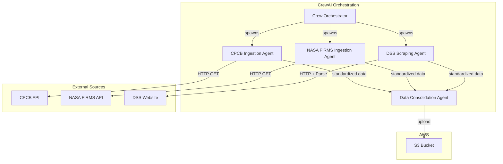

# Design Document: SensorIngestAgent

## Overview

SensorIngestAgent is a multi-agent orchestration system built on the CrewAI framework that autonomously ingests environmental data from three heterogeneous sources and consolidates them into AWS S3. The system employs a parallel ingestion pattern with a final consolidation step, ensuring fault tolerance and data consistency.

### Key Design Principles

- **Autonomous Operation**: Agents operate independently with minimal human intervention
- **Fault Isolation**: Failure in one data source does not prevent ingestion from others
- **Parallel Processing**: Data sources are queried concurrently to minimize total execution time
- **Standardized Output**: All data is transformed into a unified schema before storage
- **Cloud-Native Storage**: Leverages AWS S3 for scalable, durable data persistence

## Architecture

### High-Level Architecture



### Agent Workflow

1. **Initialization Phase**: CrewAI Crew is instantiated with four agents and their respective tasks
2. **Parallel Ingestion Phase**: Three ingestion agents execute concurrently
3. **Consolidation Phase**: Consolidation agent waits for all ingestion tasks to complete, then merges data
4. **Storage Phase**: Consolidated data is uploaded to S3 with timestamp-based naming

## Components and Interfaces

### 1. CrewAI Crew Configuration

**Purpose**: Orchestrates all agents and defines task dependencies

**Key Attributes**:
- `agents`: List of all agent instances (CPCB, NASA, DSS, Consolidator)
- `tasks`: List of task definitions with dependencies
- `process`: Sequential process (ingestion tasks → consolidation task)
- `verbose`: Logging level for debugging

**Configuration**:
```python
crew = Crew(
    agents=[cpcb_agent, nasa_agent, dss_agent, consolidator_agent],
    tasks=[cpcb_task, nasa_task, dss_task, consolidation_task],
    process=Process.sequential,  # Ensures consolidation waits for ingestion
    verbose=True
)
```

### 2. CPCB Ingestion Agent

**Purpose**: Retrieves air quality data from CPCB API

**Role**: "Air Quality Data Specialist"

**Goal**: "Retrieve and standardize air quality data from CPCB API"

**Tools**:
- HTTP client for API requests
- JSON parser
- Data validator

**Task Flow**:
1. Construct API request with required parameters
2. Execute HTTP GET request to CPCB endpoint
3. Validate response status and structure
4. Extract relevant fields (PM2.5, PM10, AQI, location, timestamp)
5. Transform to standardized schema
6. Return standardized data or error object

**API Details**:
- Endpoint: CPCB real-time data API (specific URL to be configured)
- Authentication: API key (if required)
- Response format: JSON

### 3. NASA FIRMS Ingestion Agent

**Purpose**: Retrieves active fire data from NASA FIRMS API

**Role**: "Fire Data Specialist"

**Goal**: "Retrieve and standardize fire hotspot data from NASA FIRMS API"

**Tools**:
- HTTP client for API requests
- JSON/CSV parser (FIRMS supports both)
- Geospatial data validator

**Task Flow**:
1. Construct API request with area of interest and date range
2. Execute HTTP GET request to NASA FIRMS endpoint
3. Validate response status and structure
4. Extract fire data (latitude, longitude, brightness, confidence, acquisition time)
5. Transform to standardized schema
6. Return standardized data or error object

**API Details**:
- Endpoint: `https://firms.modaps.eosdis.nasa.gov/api/area/`
- Authentication: API key (MAP_KEY)
- Parameters: source (VIIRS/MODIS), area coordinates, date range
- Response format: JSON or CSV

### 4. DSS Scraping Agent

**Purpose**: Scrapes pollution source data from DSS website

**Role**: "Web Scraping Specialist"

**Goal**: "Extract and standardize pollution source data from DSS website"

**Tools**:
- HTTP client (requests library)
- HTML parser (BeautifulSoup or similar)
- Data extractor with CSS/XPath selectors

**Task Flow**:
1. Send HTTP GET request to DSS website URL
2. Parse HTML response
3. Identify pollution source data elements using selectors
4. Extract structured data (source name, location, type, pollution level)
5. Transform to standardized schema
6. Return standardized data or error object

**Website Details**:
- URL: DSS pollution source portal (specific URL to be configured)
- Parsing strategy: Identify table/list structures containing pollution sources
- Handling: Respect robots.txt, implement rate limiting

### 5. Data Consolidation Agent

**Purpose**: Merges data from all sources into unified format and uploads to S3

**Role**: "Data Integration Specialist"

**Goal**: "Consolidate multi-source environmental data and store in S3"

**Tools**:
- Data merger
- Schema validator
- AWS S3 client (boto3)

**Task Flow**:
1. Receive outputs from all three ingestion agents
2. Check each output for errors
3. Merge successful data into consolidated structure
4. Add metadata (ingestion timestamp, source identifiers, version)
5. Validate consolidated data against schema
6. Generate filename with timestamp
7. Upload to S3 bucket
8. Verify upload success
9. Return summary report

**Context Dependencies**:
- Requires outputs from CPCB, NASA, and DSS tasks
- Task dependency ensures it runs after all ingestion tasks complete

## Data Models

### Standardized Data Schema

Each ingestion agent transforms source-specific data into this common schema:

```python
{
    "source": str,  # "cpcb", "nasa_firms", or "dss"
    "timestamp": str,  # ISO 8601 format
    "data_type": str,  # "air_quality", "fire", or "pollution_source"
    "records": [
        {
            "id": str,  # Unique identifier
            "location": {
                "latitude": float,
                "longitude": float,
                "name": str  # Optional location name
            },
            "measurements": dict,  # Source-specific measurements
            "metadata": dict  # Additional context
        }
    ],
    "status": str,  # "success" or "error"
    "error_message": str  # Present if status is "error"
}
```

### CPCB Data Transformation

**Input** (CPCB API response):
```json
{
    "station": "Delhi - ITO",
    "pollutant_id": "PM2.5",
    "pollutant_avg": "150",
    "latitude": "28.6273",
    "longitude": "77.2410"
}
```

**Output** (Standardized):
```python
{
    "source": "cpcb",
    "timestamp": "2025-11-13T10:30:00Z",
    "data_type": "air_quality",
    "records": [{
        "id": "cpcb_delhi_ito_20251113",
        "location": {
            "latitude": 28.6273,
            "longitude": 77.2410,
            "name": "Delhi - ITO"
        },
        "measurements": {
            "PM2.5": 150,
            "unit": "µg/m³"
        },
        "metadata": {
            "station_id": "delhi_ito"
        }
    }],
    "status": "success"
}
```

### NASA FIRMS Data Transformation

**Input** (NASA FIRMS API response):
```json
{
    "latitude": 28.5,
    "longitude": 77.3,
    "brightness": 325.5,
    "confidence": 85,
    "acq_date": "2025-11-13",
    "acq_time": "0530"
}
```

**Output** (Standardized):
```python
{
    "source": "nasa_firms",
    "timestamp": "2025-11-13T10:30:00Z",
    "data_type": "fire",
    "records": [{
        "id": "firms_28.5_77.3_20251113",
        "location": {
            "latitude": 28.5,
            "longitude": 77.3
        },
        "measurements": {
            "brightness": 325.5,
            "confidence": 85,
            "unit": "Kelvin"
        },
        "metadata": {
            "acquisition_date": "2025-11-13",
            "acquisition_time": "0530"
        }
    }],
    "status": "success"
}
```

### DSS Data Transformation

**Input** (Scraped HTML data):
```html
<tr>
    <td>Industrial Unit A</td>
    <td>28.6, 77.2</td>
    <td>Manufacturing</td>
    <td>High</td>
</tr>
```

**Output** (Standardized):
```python
{
    "source": "dss",
    "timestamp": "2025-11-13T10:30:00Z",
    "data_type": "pollution_source",
    "records": [{
        "id": "dss_industrial_unit_a",
        "location": {
            "latitude": 28.6,
            "longitude": 77.2,
            "name": "Industrial Unit A"
        },
        "measurements": {
            "pollution_level": "High"
        },
        "metadata": {
            "source_type": "Manufacturing"
        }
    }],
    "status": "success"
}
```

### Consolidated Data Structure

The final structure uploaded to S3:

```python
{
    "consolidation_timestamp": "2025-11-13T10:30:00Z",
    "version": "1.0",
    "sources": {
        "cpcb": {
            "status": "success",
            "record_count": 10,
            "data": {...}  # Standardized CPCB data
        },
        "nasa_firms": {
            "status": "success",
            "record_count": 5,
            "data": {...}  # Standardized NASA data
        },
        "dss": {
            "status": "success",
            "record_count": 8,
            "data": {...}  # Standardized DSS data
        }
    },
    "summary": {
        "total_records": 23,
        "successful_sources": 3,
        "failed_sources": 0
    }
}
```

## Error Handling

### Error Categories

1. **Network Errors**: Connection timeouts, DNS failures, unreachable endpoints
2. **API Errors**: Authentication failures, rate limiting, invalid responses
3. **Parsing Errors**: Malformed JSON, unexpected HTML structure
4. **Validation Errors**: Data doesn't match expected schema
5. **Storage Errors**: S3 upload failures, permission issues

### Error Handling Strategy

**Per-Agent Error Handling**:
- Each ingestion agent wraps its execution in try-except blocks
- Errors are logged with full context (timestamp, agent name, error type, stack trace)
- Agent returns error object instead of raising exception
- Error object follows standardized schema with `status: "error"`

**Consolidation Error Handling**:
- Consolidation agent checks status of each ingestion result
- Partial success is acceptable (e.g., 2 out of 3 sources succeed)
- Failed sources are documented in summary report
- Consolidation proceeds with available data

**S3 Upload Error Handling**:
- Implement retry logic with exponential backoff (3 attempts)
- Retry delays: 1s, 2s, 4s
- If all retries fail, log error and raise exception
- Consider implementing local backup storage for failed uploads

### Logging Strategy

**Log Levels**:
- `INFO`: Agent start/completion, successful API calls, S3 uploads
- `WARNING`: Retries, partial failures, rate limiting
- `ERROR`: Failed API calls, parsing errors, validation failures
- `CRITICAL`: Complete system failures, S3 upload failures after retries

**Log Format**:
```python
{
    "timestamp": "2025-11-13T10:30:00Z",
    "level": "ERROR",
    "agent": "cpcb_ingestion_agent",
    "message": "Failed to retrieve data from CPCB API",
    "error_type": "ConnectionTimeout",
    "details": {...}
}
```

## AWS S3 Integration

### S3 Configuration

**Bucket Structure**:
```
sensor-ingest-data/
├── raw/
│   └── YYYY/
│       └── MM/
│           └── DD/
│               └── consolidated_YYYYMMDD_HHMMSS.json
└── logs/
    └── YYYY/
        └── MM/
            └── DD/
                └── execution_log_YYYYMMDD_HHMMSS.json
```

**Naming Convention**:
- Data files: `consolidated_{timestamp}.json` where timestamp is `YYYYMMDD_HHMMSS`
- Log files: `execution_log_{timestamp}.json`

**S3 Client Configuration**:
```python
import boto3

s3_client = boto3.client(
    's3',
    aws_access_key_id=os.getenv('AWS_ACCESS_KEY_ID'),
    aws_secret_access_key=os.getenv('AWS_SECRET_ACCESS_KEY'),
    region_name=os.getenv('AWS_REGION', 'us-east-1')
)
```

**Upload Implementation**:
- Use `put_object` method for JSON uploads
- Set content type to `application/json`
- Enable server-side encryption (SSE-S3)
- Add metadata tags (source, version, ingestion_date)

**IAM Permissions Required**:
```json
{
    "Version": "2012-10-17",
    "Statement": [
        {
            "Effect": "Allow",
            "Action": [
                "s3:PutObject",
                "s3:PutObjectAcl"
            ],
            "Resource": "arn:aws:s3:::sensor-ingest-data/*"
        }
    ]
}
```

## Testing Strategy

### Unit Testing

**Agent Testing**:
- Mock external API calls using `responses` or `unittest.mock`
- Test data transformation logic with sample inputs
- Verify error handling with simulated failures
- Test schema validation with valid and invalid data

**Test Cases per Agent**:
1. Successful data retrieval and transformation
2. API timeout handling
3. Invalid response format handling
4. Empty response handling
5. Authentication failure handling

### Integration Testing

**Crew Execution Testing**:
- Use test API endpoints or mock servers
- Verify agent coordination and task dependencies
- Test parallel execution of ingestion agents
- Verify consolidation agent receives all inputs
- Test S3 upload with test bucket

**Test Scenarios**:
1. All sources succeed
2. One source fails, others succeed
3. All sources fail
4. S3 upload fails and retries
5. Network interruption during execution

### End-to-End Testing

**Full Pipeline Testing**:
- Execute against real APIs (in test/staging environment)
- Verify data quality and completeness
- Check S3 bucket for uploaded files
- Validate file structure and content
- Monitor execution time and resource usage

**Validation Checks**:
- Data completeness: All expected fields present
- Data accuracy: Values within expected ranges
- Timestamp consistency: All timestamps in ISO 8601 format
- File integrity: Valid JSON structure
- S3 metadata: Correct tags and permissions

## Configuration Management

### Environment Variables

```bash
# API Configuration
CPCB_API_URL=https://api.cpcb.gov.in/...
CPCB_API_KEY=your_api_key_here
NASA_FIRMS_API_KEY=your_map_key_here
NASA_FIRMS_API_URL=https://firms.modaps.eosdis.nasa.gov/api/area/
DSS_WEBSITE_URL=https://dss.delhi.gov.in/...

# AWS Configuration
AWS_ACCESS_KEY_ID=your_access_key
AWS_SECRET_ACCESS_KEY=your_secret_key
AWS_REGION=us-east-1
S3_BUCKET_NAME=sensor-ingest-data

# Application Configuration
LOG_LEVEL=INFO
RETRY_ATTEMPTS=3
REQUEST_TIMEOUT=30
```

### Configuration File

Alternative to environment variables, use a `config.yaml`:

```yaml
apis:
  cpcb:
    url: ${CPCB_API_URL}
    api_key: ${CPCB_API_KEY}
    timeout: 30
  nasa_firms:
    url: ${NASA_FIRMS_API_URL}
    api_key: ${NASA_FIRMS_API_KEY}
    timeout: 30
  dss:
    url: ${DSS_WEBSITE_URL}
    timeout: 30

aws:
  region: us-east-1
  s3:
    bucket: sensor-ingest-data
    prefix: raw/

logging:
  level: INFO
  format: json

retry:
  max_attempts: 3
  backoff_factor: 2
```

## Performance Considerations

### Execution Time

**Expected Timings**:
- CPCB API call: 2-5 seconds
- NASA FIRMS API call: 3-7 seconds
- DSS scraping: 5-10 seconds
- Data consolidation: 1-2 seconds
- S3 upload: 1-3 seconds

**Total Expected Time**: 12-27 seconds (with parallel ingestion)

### Optimization Strategies

1. **Parallel Ingestion**: Use CrewAI's parallel task execution
2. **Connection Pooling**: Reuse HTTP connections
3. **Caching**: Cache API responses for development/testing
4. **Compression**: Compress JSON before S3 upload for large datasets
5. **Batch Processing**: If running on schedule, batch multiple executions

### Resource Requirements

- **Memory**: ~200-500 MB (depends on data volume)
- **CPU**: Minimal (I/O bound operations)
- **Network**: Stable internet connection required
- **Storage**: Minimal local storage (data streamed to S3)

## Deployment Considerations

### Execution Modes

1. **Local Development**: Run from command line with `python main.py`
2. **Scheduled Execution**: Use cron job or AWS EventBridge
3. **Containerized**: Deploy as Docker container
4. **Serverless**: Deploy on AWS Lambda (with extended timeout)

### Recommended Deployment: AWS Lambda + EventBridge

**Benefits**:
- No server management
- Pay per execution
- Automatic scaling
- Native S3 integration

**Configuration**:
- Runtime: Python 3.11
- Memory: 512 MB
- Timeout: 5 minutes
- Trigger: EventBridge rule (e.g., every 6 hours)

### Dependencies

**Python Packages**:
```
crewai>=0.1.0
boto3>=1.28.0
requests>=2.31.0
beautifulsoup4>=4.12.0
pydantic>=2.0.0
python-dotenv>=1.0.0
```

## Security Considerations

1. **API Keys**: Store in AWS Secrets Manager or environment variables
2. **S3 Access**: Use IAM roles instead of access keys when possible
3. **Data Encryption**: Enable S3 server-side encryption
4. **Network Security**: Use HTTPS for all API calls
5. **Input Validation**: Sanitize scraped data before processing
6. **Rate Limiting**: Respect API rate limits to avoid blocking
7. **Secrets Management**: Never commit credentials to version control

## Future Enhancements

1. **Data Validation**: Implement more sophisticated data quality checks
2. **Alerting**: Add SNS notifications for failures
3. **Monitoring**: Integrate with CloudWatch for metrics and dashboards
4. **Data Versioning**: Implement versioning for schema changes
5. **Historical Analysis**: Add agent to compare current vs historical data
6. **Real-time Processing**: Stream data to Kinesis for real-time analytics
7. **Multi-region Support**: Expand to ingest data from multiple geographic regions
