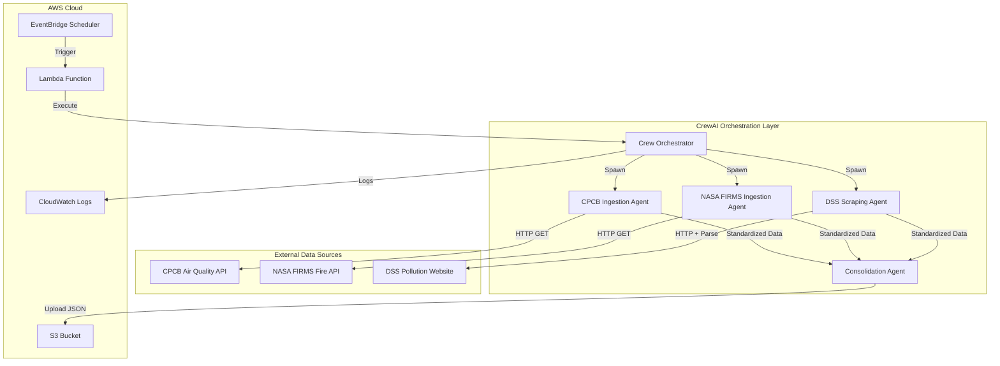
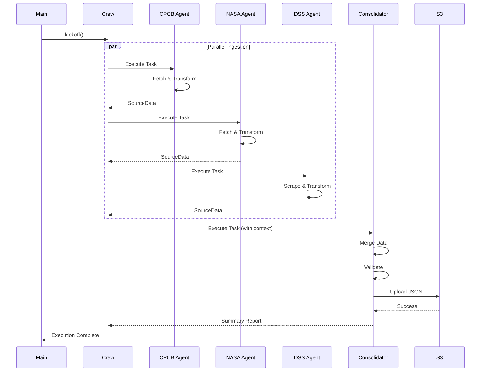

# SensorIngestAgent - Technical Specification

## Architecture Overview

SensorIngestAgent is a multi-agent orchestration system built on CrewAI that autonomously ingests environmental data from three heterogeneous sources and consolidates them into AWS S3.

### System Architecture Diagram



## Technology Stack

### Core Framework
- **CrewAI** (v0.1.0+): Multi-agent orchestration framework
  - Provides agent abstraction and task coordination
  - Handles parallel execution and dependencies
  - Built-in logging and error handling

### Programming Language
- **Python 3.11+**: Primary development language
  - Type hints for better code quality
  - Async/await support for concurrent operations
  - Rich ecosystem for data processing

### Key Libraries

#### Data Processing
- **Pydantic** (v2.0+): Data validation and schema definition
- **requests** (v2.31+): HTTP client for API calls
- **beautifulsoup4** (v4.12+): HTML parsing for web scraping
- **lxml**: Fast XML/HTML parser backend

#### AWS Integration
- **boto3** (v1.28+): AWS SDK for Python
  - S3 client for file uploads
  - IAM role integration
  - CloudWatch logging

#### Configuration & Environment
- **python-dotenv** (v1.0+): Environment variable management
- **PyYAML**: Configuration file parsing

#### Testing
- **pytest**: Unit and integration testing
- **pytest-mock**: Mocking external dependencies
- **responses**: HTTP request mocking
- **moto**: AWS service mocking

#### Development Tools
- **black**: Code formatting
- **ruff**: Fast Python linter
- **mypy**: Static type checking

## Component Architecture

### 1. Agent Layer

#### CPCB Ingestion Agent
```python
Role: "Air Quality Data Specialist"
Goal: "Retrieve and standardize air quality data from CPCB API"
Tools: [HTTPClient, JSONParser, DataValidator]
```

**Responsibilities**:
- Construct authenticated API requests
- Parse JSON responses
- Extract air quality metrics (PM2.5, PM10, AQI)
- Transform to standardized schema
- Handle API errors and timeouts

**Key Methods**:
```python
def fetch_cpcb_data() -> SourceData:
    """Fetch and transform CPCB air quality data"""
    
def validate_cpcb_response(response: dict) -> bool:
    """Validate CPCB API response structure"""
    
def transform_cpcb_to_standard(raw_data: dict) -> SourceData:
    """Transform CPCB format to standardized schema"""
```

#### NASA FIRMS Ingestion Agent
```python
Role: "Fire Data Specialist"
Goal: "Retrieve and standardize fire hotspot data from NASA FIRMS API"
Tools: [HTTPClient, CSVParser, GeospatialValidator]
```

**Responsibilities**:
- Construct API requests with area and date parameters
- Parse JSON or CSV responses
- Extract fire coordinates and confidence levels
- Transform to standardized schema
- Handle API rate limiting

**Key Methods**:
```python
def fetch_firms_data(area: str, date_range: str) -> SourceData:
    """Fetch and transform NASA FIRMS fire data"""
    
def parse_firms_response(response: str, format: str) -> list:
    """Parse FIRMS response (JSON or CSV)"""
    
def transform_firms_to_standard(raw_data: list) -> SourceData:
    """Transform FIRMS format to standardized schema"""
```

#### DSS Scraping Agent
```python
Role: "Web Scraping Specialist"
Goal: "Extract and standardize pollution source data from DSS website"
Tools: [HTTPClient, HTMLParser, DataExtractor]
```

**Responsibilities**:
- Send HTTP requests to DSS website
- Parse HTML with BeautifulSoup
- Extract pollution source information
- Transform to standardized schema
- Handle website changes and errors

**Key Methods**:
```python
def scrape_dss_data(url: str) -> SourceData:
    """Scrape and transform DSS pollution source data"""
    
def parse_dss_html(html: str) -> list:
    """Parse DSS website HTML structure"""
    
def extract_pollution_sources(soup: BeautifulSoup) -> list:
    """Extract pollution source data from parsed HTML"""
    
def transform_dss_to_standard(raw_data: list) -> SourceData:
    """Transform DSS format to standardized schema"""
```

#### Consolidation Agent
```python
Role: "Data Integration Specialist"
Goal: "Consolidate multi-source environmental data and store in S3"
Tools: [DataMerger, SchemaValidator, S3Client]
```

**Responsibilities**:
- Receive outputs from all ingestion agents
- Check status of each source
- Merge successful data into consolidated structure
- Add metadata and timestamps
- Upload to S3 with retry logic
- Generate execution summary

**Key Methods**:
```python
def consolidate_data(cpcb: SourceData, nasa: SourceData, dss: SourceData) -> ConsolidatedData:
    """Merge data from all sources"""
    
def validate_consolidated_data(data: ConsolidatedData) -> bool:
    """Validate consolidated data structure"""
    
def upload_to_s3(data: ConsolidatedData) -> str:
    """Upload consolidated data to S3 with retry logic"""
    
def generate_summary(data: ConsolidatedData) -> dict:
    """Generate execution summary report"""
```

### 2. Data Model Layer

#### Standardized Schema (Pydantic Models)

```python
from pydantic import BaseModel, Field
from typing import Optional, Dict, List
from datetime import datetime

class Location(BaseModel):
    """Geographic location"""
    latitude: float = Field(..., ge=-90, le=90)
    longitude: float = Field(..., ge=-180, le=180)
    name: Optional[str] = None

class Record(BaseModel):
    """Individual data record"""
    id: str
    location: Location
    measurements: Dict[str, float | str]
    metadata: Dict[str, str]

class SourceData(BaseModel):
    """Standardized data from a single source"""
    source: str  # "cpcb", "nasa_firms", or "dss"
    timestamp: datetime
    data_type: str  # "air_quality", "fire", or "pollution_source"
    records: List[Record]
    status: str  # "success" or "error"
    error_message: Optional[str] = None

class ConsolidatedData(BaseModel):
    """Final consolidated data structure"""
    consolidation_timestamp: datetime
    version: str = "1.0"
    sources: Dict[str, SourceData]
    summary: Dict[str, int]
```

### 3. Configuration Layer

#### Configuration Structure

```python
from pydantic_settings import BaseSettings

class APIConfig(BaseSettings):
    """API configuration"""
    cpcb_url: str
    cpcb_api_key: Optional[str] = None
    nasa_firms_url: str
    nasa_firms_api_key: str
    dss_url: str
    request_timeout: int = 30

class AWSConfig(BaseSettings):
    """AWS configuration"""
    aws_region: str = "us-east-1"
    s3_bucket_name: str
    s3_prefix: str = "raw/"
    aws_access_key_id: Optional[str] = None
    aws_secret_access_key: Optional[str] = None

class AppConfig(BaseSettings):
    """Application configuration"""
    log_level: str = "INFO"
    retry_attempts: int = 3
    retry_backoff_factor: int = 2
    
    api: APIConfig
    aws: AWSConfig
    
    class Config:
        env_file = ".env"
        env_nested_delimiter = "__"
```

### 4. Utility Layer

#### HTTP Client Wrapper
```python
class HTTPClient:
    """Reusable HTTP client with timeout and retry logic"""
    
    def __init__(self, timeout: int = 30):
        self.session = requests.Session()
        self.timeout = timeout
    
    def get(self, url: str, params: dict = None, headers: dict = None) -> requests.Response:
        """Execute GET request with error handling"""
        
    def close(self):
        """Close session"""
        self.session.close()
```

#### S3 Client Wrapper
```python
class S3Client:
    """S3 client with retry logic and helper methods"""
    
    def __init__(self, bucket_name: str, region: str = "us-east-1"):
        self.s3 = boto3.client('s3', region_name=region)
        self.bucket_name = bucket_name
    
    def upload_json(self, data: dict, key: str, metadata: dict = None) -> str:
        """Upload JSON data to S3 with retry logic"""
        
    def generate_key(self, prefix: str, timestamp: datetime) -> str:
        """Generate S3 key with date-based folder structure"""
```

#### Logger Configuration
```python
import logging

def setup_logging(level: str = "INFO") -> logging.Logger:
    """Configure application logging"""
    logging.basicConfig(
        level=getattr(logging, level),
        format='%(asctime)s - %(name)s - %(levelname)s - %(message)s',
        handlers=[
            logging.StreamHandler(),
            logging.FileHandler('sensor_ingest.log')
        ]
    )
    return logging.getLogger('sensor_ingest_agent')
```

## Data Flow

### Execution Sequence



### Data Transformation Pipeline

1. **Raw Data Ingestion**
   - Agent fetches data from source
   - Validates response structure
   - Logs raw data size and format

2. **Standardization**
   - Extract relevant fields
   - Map to standardized schema
   - Validate with Pydantic models
   - Add source metadata

3. **Consolidation**
   - Collect all standardized data
   - Check for errors
   - Merge into unified structure
   - Add consolidation metadata

4. **Storage**
   - Serialize to JSON
   - Generate S3 key with timestamp
   - Upload with retry logic
   - Verify upload success

## Error Handling Strategy

### Error Categories and Responses

| Error Type | Handling Strategy | Recovery Action |
|------------|------------------|-----------------|
| Network Timeout | Retry with backoff | Log and continue |
| API Authentication | Fail fast | Raise exception |
| Invalid Response | Log and return error object | Continue with other sources |
| Parsing Error | Log with context | Return error object |
| Validation Error | Log invalid data | Return error object |
| S3 Upload Failure | Retry 3 times | Raise exception if all fail |

### Retry Logic Implementation

```python
def retry_with_backoff(func, max_attempts=3, backoff_factor=2):
    """Retry function with exponential backoff"""
    for attempt in range(max_attempts):
        try:
            return func()
        except Exception as e:
            if attempt == max_attempts - 1:
                raise
            wait_time = backoff_factor ** attempt
            logger.warning(f"Attempt {attempt + 1} failed, retrying in {wait_time}s")
            time.sleep(wait_time)
```

## AWS Integration

### S3 Bucket Structure

```
sensor-ingest-data/
├── raw/
│   ├── 2025/
│   │   ├── 11/
│   │   │   ├── 13/
│   │   │   │   ├── consolidated_20251113_103000.json
│   │   │   │   ├── consolidated_20251113_163000.json
│   │   │   │   └── consolidated_20251113_223000.json
│   │   │   └── 14/
│   │   └── 12/
│   └── 2026/
└── logs/
    └── 2025/
        └── 11/
            └── 13/
                └── execution_log_20251113_103000.json
```

### IAM Policy

```json
{
    "Version": "2012-10-17",
    "Statement": [
        {
            "Sid": "S3WriteAccess",
            "Effect": "Allow",
            "Action": [
                "s3:PutObject",
                "s3:PutObjectAcl"
            ],
            "Resource": "arn:aws:s3:::sensor-ingest-data/*"
        },
        {
            "Sid": "CloudWatchLogs",
            "Effect": "Allow",
            "Action": [
                "logs:CreateLogGroup",
                "logs:CreateLogStream",
                "logs:PutLogEvents"
            ],
            "Resource": "arn:aws:logs:*:*:*"
        }
    ]
}
```

### Lambda Configuration

```yaml
FunctionName: SensorIngestAgent
Runtime: python3.11
Handler: main.lambda_handler
Timeout: 300  # 5 minutes
MemorySize: 512  # MB
Environment:
  Variables:
    CPCB_API_URL: ${CPCB_API_URL}
    CPCB_API_KEY: ${CPCB_API_KEY}
    NASA_FIRMS_API_KEY: ${NASA_FIRMS_API_KEY}
    NASA_FIRMS_API_URL: https://firms.modaps.eosdis.nasa.gov/api/area/
    DSS_WEBSITE_URL: ${DSS_WEBSITE_URL}
    S3_BUCKET_NAME: sensor-ingest-data
    AWS_REGION: us-east-1
    LOG_LEVEL: INFO
Role: arn:aws:iam::ACCOUNT_ID:role/SensorIngestAgentRole
```

### EventBridge Schedule

```json
{
    "Name": "SensorIngestSchedule",
    "ScheduleExpression": "rate(6 hours)",
    "State": "ENABLED",
    "Target": {
        "Arn": "arn:aws:lambda:us-east-1:ACCOUNT_ID:function:SensorIngestAgent",
        "Id": "1"
    }
}
```

## Deployment Options

### Option 1: Local Development

```bash
# Install dependencies
pip install -r requirements.txt

# Configure environment
cp .env.example .env
# Edit .env with your API keys and AWS credentials

# Run locally
python main.py
```

### Option 2: Docker Container

```dockerfile
FROM python:3.11-slim

WORKDIR /app

COPY requirements.txt .
RUN pip install --no-cache-dir -r requirements.txt

COPY . .

CMD ["python", "main.py"]
```

```bash
# Build and run
docker build -t sensor-ingest-agent .
docker run --env-file .env sensor-ingest-agent
```

### Option 3: AWS Lambda

```bash
# Package dependencies
pip install -r requirements.txt -t package/
cd package
zip -r ../deployment-package.zip .
cd ..
zip -g deployment-package.zip main.py agents/ models/ utils/

# Deploy with AWS CLI
aws lambda create-function \
    --function-name SensorIngestAgent \
    --runtime python3.11 \
    --role arn:aws:iam::ACCOUNT_ID:role/SensorIngestAgentRole \
    --handler main.lambda_handler \
    --zip-file fileb://deployment-package.zip \
    --timeout 300 \
    --memory-size 512
```

## Performance Characteristics

### Expected Performance

| Metric | Value | Notes |
|--------|-------|-------|
| Total Execution Time | 12-27 seconds | With parallel ingestion |
| CPCB API Call | 2-5 seconds | Depends on API response time |
| NASA FIRMS API Call | 3-7 seconds | Depends on data volume |
| DSS Scraping | 5-10 seconds | Depends on website load time |
| Data Consolidation | 1-2 seconds | In-memory processing |
| S3 Upload | 1-3 seconds | Depends on file size |
| Memory Usage | 200-500 MB | Depends on data volume |

### Optimization Strategies

1. **Connection Pooling**: Reuse HTTP connections across requests
2. **Parallel Execution**: CrewAI executes ingestion agents concurrently
3. **Streaming**: Stream large responses instead of loading into memory
4. **Compression**: Compress JSON before S3 upload for large datasets
5. **Caching**: Cache API responses during development/testing

## Security Considerations

### Secrets Management

- Store API keys in AWS Secrets Manager or environment variables
- Never commit credentials to version control
- Use IAM roles instead of access keys when running on AWS
- Rotate API keys regularly

### Data Security

- Enable S3 server-side encryption (SSE-S3 or SSE-KMS)
- Use HTTPS for all API calls
- Validate and sanitize scraped data before processing
- Implement input validation with Pydantic

### Network Security

- Use VPC endpoints for S3 access when running in Lambda
- Implement rate limiting to respect API quotas
- Add user-agent headers to web scraping requests
- Respect robots.txt for web scraping

## Monitoring and Observability

### CloudWatch Metrics

- Lambda invocation count
- Lambda duration
- Lambda errors
- S3 upload success/failure rate

### Custom Metrics

```python
cloudwatch = boto3.client('cloudwatch')

cloudwatch.put_metric_data(
    Namespace='SensorIngestAgent',
    MetricData=[
        {
            'MetricName': 'SuccessfulSources',
            'Value': successful_count,
            'Unit': 'Count'
        },
        {
            'MetricName': 'ExecutionDuration',
            'Value': duration_seconds,
            'Unit': 'Seconds'
        }
    ]
)
```

### Logging Strategy

- Structured JSON logging for easy parsing
- Log levels: DEBUG, INFO, WARNING, ERROR, CRITICAL
- Include correlation IDs for tracing
- Log to CloudWatch Logs when running on Lambda

## Testing Strategy

### Unit Tests

```python
# Test data transformation
def test_transform_cpcb_to_standard():
    raw_data = {...}
    result = transform_cpcb_to_standard(raw_data)
    assert result.source == "cpcb"
    assert len(result.records) > 0

# Test error handling
def test_cpcb_agent_handles_timeout():
    with pytest.raises(TimeoutError):
        fetch_cpcb_data(timeout=0.001)
```

### Integration Tests

```python
# Test crew execution with mocked APIs
@responses.activate
def test_crew_execution_all_sources_succeed():
    responses.add(responses.GET, CPCB_URL, json={...}, status=200)
    responses.add(responses.GET, NASA_URL, json={...}, status=200)
    responses.add(responses.GET, DSS_URL, body="<html>...</html>", status=200)
    
    result = crew.kickoff()
    assert result.summary['successful_sources'] == 3
```

### End-to-End Tests

```python
# Test full pipeline with test bucket
def test_e2e_ingestion_to_s3():
    result = main()
    
    # Verify S3 upload
    s3 = boto3.client('s3')
    objects = s3.list_objects_v2(Bucket=TEST_BUCKET, Prefix='raw/')
    assert objects['KeyCount'] > 0
```

## Dependencies

### Production Dependencies

```txt
crewai>=0.1.0
boto3>=1.28.0
requests>=2.31.0
beautifulsoup4>=4.12.0
lxml>=4.9.0
pydantic>=2.0.0
pydantic-settings>=2.0.0
python-dotenv>=1.0.0
```

### Development Dependencies

```txt
pytest>=7.4.0
pytest-mock>=3.11.0
pytest-cov>=4.1.0
responses>=0.23.0
moto>=4.2.0
black>=23.7.0
ruff>=0.0.285
mypy>=1.5.0
```

## API Documentation

### CPCB API

- **Endpoint**: To be configured (CPCB real-time data API)
- **Method**: GET
- **Authentication**: API key (if required)
- **Response Format**: JSON
- **Rate Limit**: TBD

### NASA FIRMS API

- **Endpoint**: `https://firms.modaps.eosdis.nasa.gov/api/area/`
- **Method**: GET
- **Authentication**: MAP_KEY parameter
- **Parameters**:
  - `source`: VIIRS_SNPP_NRT or MODIS_NRT
  - `area`: Coordinates or country code
  - `day_range`: Number of days (1-10)
- **Response Format**: JSON or CSV
- **Rate Limit**: 100 requests per hour
- **Documentation**: https://firms.modaps.eosdis.nasa.gov/api/

### DSS Website

- **URL**: To be configured (DSS pollution source portal)
- **Method**: GET (web scraping)
- **Authentication**: None
- **Parsing**: HTML with BeautifulSoup
- **Rate Limit**: Respect robots.txt

## Conclusion

SensorIngestAgent demonstrates a production-ready, cloud-native architecture for autonomous environmental data ingestion. The multi-agent design provides modularity, fault tolerance, and extensibility, while AWS integration ensures scalability and reliability. The system is ready for deployment and can serve as a foundation for comprehensive environmental monitoring platforms.
